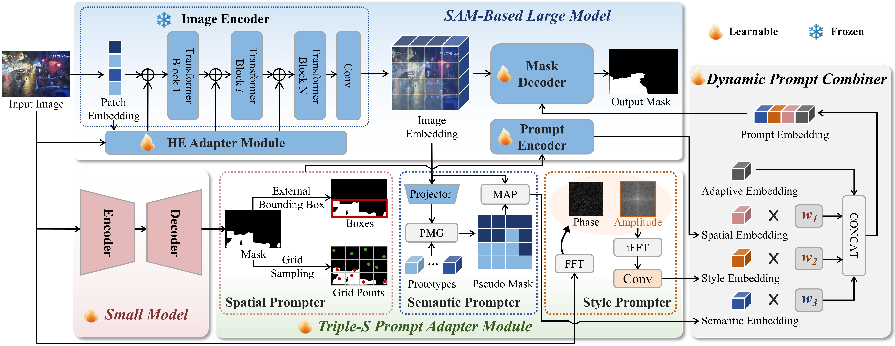
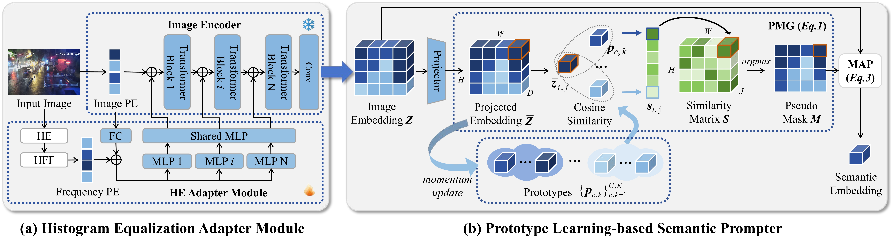
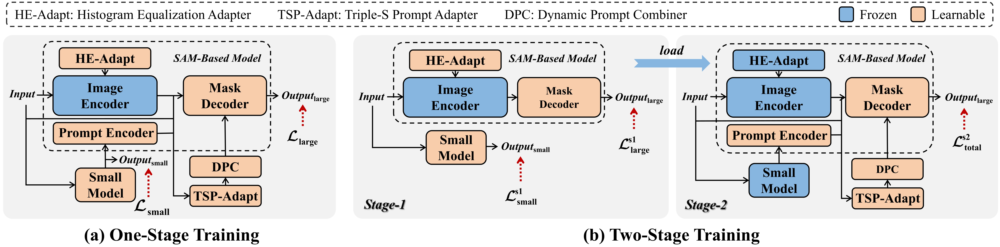

<div align="center">
<h1>Urban Waterlogging Detection: A Challenging Benchmark and Large-Small Model Co-Adapter [ECCV2024]</h1>

Suqi Song<sup>1†</sup>, Chenxu Zhang<sup>1†</sup>, Peng Zhang<sup>1</sup>, Pengkun Li<sup>2</sup>, Fenglong Song<sup>3</sup>, Lei Zhang<sup>1*</sup>

<sup>1</sup>Chongqing University,
<sup>2</sup>Huawei Technologies Co., Ltd.,
<sup>3</sup>Huawei Noah's Ark Lab

<div>
<sup>†</sup> Equal contribution
<sup>*</sup> Corresponding author
</div>

<div>
  {songsuqi, zhangpeng}@stu.cqu.edu.cn, {zhangchenxu, leizhang}@cqu.edu.cn, {lipengkun3, songfenglong}@huawei.com
</div>

## Abstract

Urban waterlogging poses a major risk to public safety and infrastructure. Conventional methods using water-level sensors need high-maintenance to hardly achieve full coverage. Recent advances employ surveillance camera imagery and deep learning for detection, yet these struggle amidst scarce data and adverse environmental conditions. In this paper, we establish a challenging Urban Waterlogging Benchmark (UW-Bench) under diverse adverse conditions to advance real-world applications. We propose a Large-Small Model co-adapter paradigm (LSM-adapter), which harnesses the substantial generic segmentation potential of large model and the specific task-directed guidance of small model. Specifically, a Triple-S Prompt Adapter module alongside a Dynamic Prompt Combiner are proposed to generate then merge multiple prompts for mask decoder adaptation. Meanwhile, a Histogram Equalization Adap-ter module is designed to infuse the image specific information for image encoder adaptation. Results and analysis show the challenge and superiority of our developed benchmark and algorithm.
<div align="center">
  
</div>

## Overview

* We propose an innovative large-small model co-adapter paradigm (LSM-adapter), aiming at achieving win-win regime. In order to learn a robust prompter, a Triple-S prompt adapter (TSP-Adapt) with a dynamic prompt combiner is formulated, enabling a success on adaptation. We pioneer the use of vision foundation model i.e., SAM for urban waterlogging detection, providing new insights for future research.

<div align="center">
  
</div>
<p>
  The proposed Large-Small Model Co-adapter Paradigm, which include a histogram equalization adapter, 
  a triple-S prompt adapter and a dynamic prompt combiner. All components except the image encoder of 
  SAM are trained for prompt generation, learning and adaptation, toward adverse waterlogging detection.
</p>

* **Details of the proposed HE-Adapt and Semantic Prompter**

<div align="center">
  
</div>
<p>
  The proposed histogram equalization adapter module mainly consists of a histogram equalization, a high-frequency filter and MLP blocks.
  Given that the features of water are not pronounced in most challenging scenarios, we first conduct histogram equalization operation to 
  highlight the contrast and texture of input image. %which can enhance the  of water, and make the boundaries more distinct. The enhanced 
  image is then passed through a high-frequency filter to extract high-frequency information beneficial for segmentation, and converted into 
  frequency patch embedding. The image embedding of large model contains rich semantic information. Therefore, we propose a prototype learning-based 
  semantic prompter, which leverages useful foreground features from large model to generate semantic prompts.
</p>

* **One-stage and Two-stage training strategies**

<div align="center">
  
</div>
<p>
  Two training strategies are proposed to explore suitable joint training of models with diverse architectures.
</p>

## UW-Bench Dataset

<div align="center">
  
</div>
<p>
  Training and testing examples in the developed UW-Bench. For objectively evaluating the capability of the model 
  in real-world applications, we consider both <i>general-sample</i> and <i>hard-sample</i> cases in test set.
</p>

</div>

* The training set is available in [BaiduPan](https://pan.baidu.com/s/1dPGRJrzRt1nBDlMdK8LiBQ?pwd=ey8b).
* Please note that</b> the training set was collected and labeled by LiVE group of Chongqing University and the test set was provided by Huawei.


## Citation

```
@inproceedings{
song2024lsmadapter,
title={Urban Waterlogging Detection: A Challenging Benchmark and Large-Small Model Co-Adapter},
author={Suqi Song and Chenxu Zhang and Peng Zhang and Pengkun Li and Fenglong Song and Lei Zhang},
journal = {ECCV},
issue_date = {2024}
}
```
